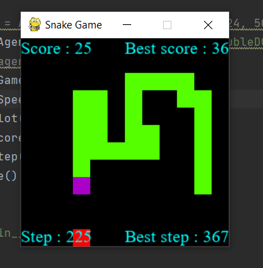

#  Snake Game and DQN Agent

This project includes a Snake game that can be played by an AI agent such as Deep Q-Network (DQN). The agent uses a convolutional neural network (CNN) as a function approximator for Q-values, and a compressed image of the game screen is used as input to the CNN model. The agent uses an epsilon-greedy policy for the exploration-exploitation trade-off. The epsilon value is reduced during training. The trained model can be saved periodically.

The project is divided into two packages:
* game - contains the snake game environment.
* agent - contains an agent to control the snake.


## Bachelor thesis
Document language: Polish

Keywords: snake game, convolutional neural network, reinforcement learning techniques, Q-Learning, Deep Q-Learning, DQN, Dueling DQN, Double DQN, Dueling Double DQN. 

The purpose of this study was to create an intelligent agent with learning skills that would achieve high scores in the popular computer game Snake. The main focus was on the application of reinforcement learning techniques, in particular the Q-Learning and Deep Q-Learning algorithms. The work also included the study of different variants of the Deep Q-Learning algorithm, such as DQN, Dueling DQN, Double DQN and Dueling Double DQN, in order to find effective game strategies for the agent. The project developed a dedicated game environment that allowed the agent to interact with the game and learn from the experience. An important aspect was the use of convolutional neural networks to analyze the image generated by the game. These networks processed visual input data, such as the game board, so that the agent could make decisions and choose optimal moves. The results achieved by the created agent were then analyzed and compared with those of other agents described in previous studies. The results of the experiments show significant contributions to the field of reinforcement learning, especially in the context of the Snake game. The techniques and strategies developed are promising, but there is still potential for further optimization and exploration of machine learning algorithms for this type of game.

## Content
* Snake game environment
* Agent DQN
* Agent Double DQN
* Agent Dueling DQN
* Agent Dueling Double DQN
* Learned models for each algorithm after 140k and 180k games played

## Game design


## Algorithm results


## Installation
To use this package, you need to install the following dependencies:

* Python 3.7 or higher (I use Python 3.10)
* Pygame
* OpenCV
* NumPy
* PyTorch
* Dash
## Usage
To launch this project

```python
  python main.py
```
